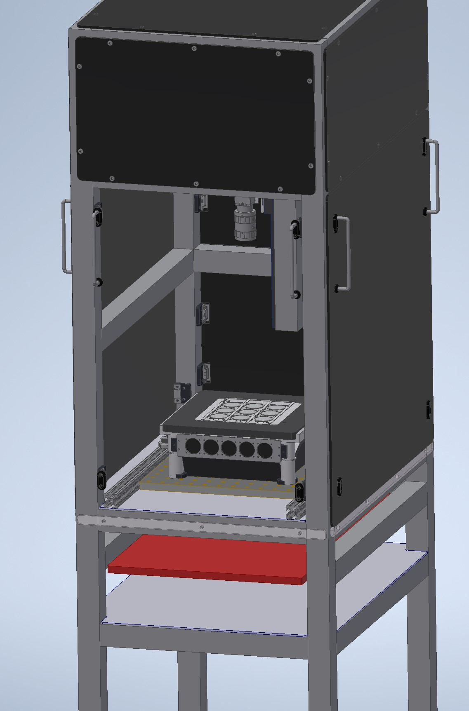
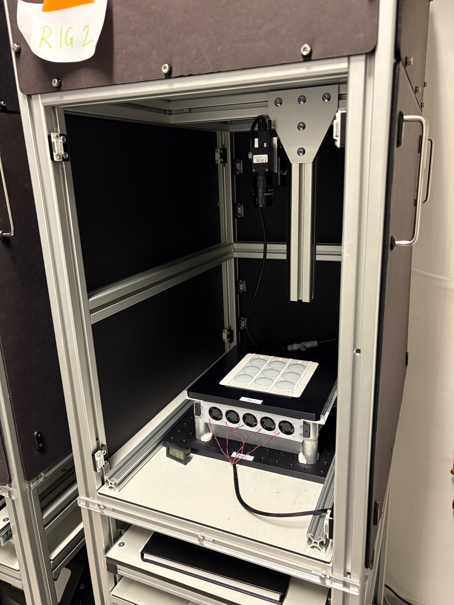
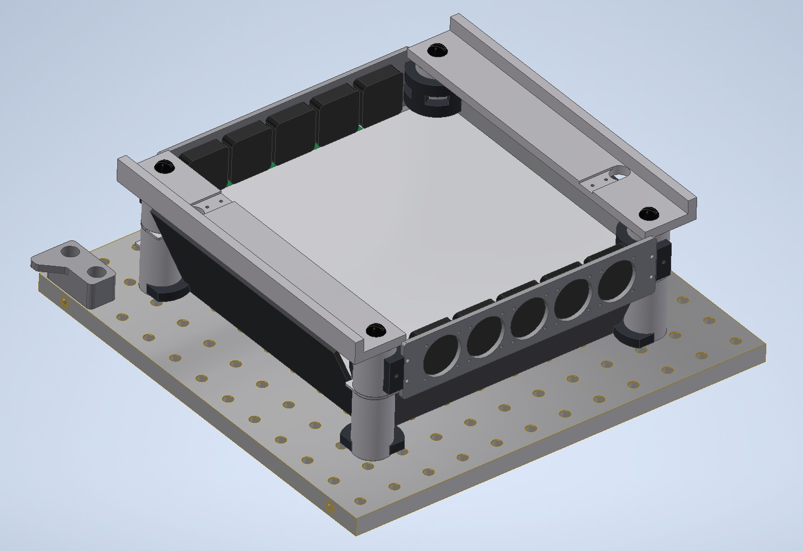
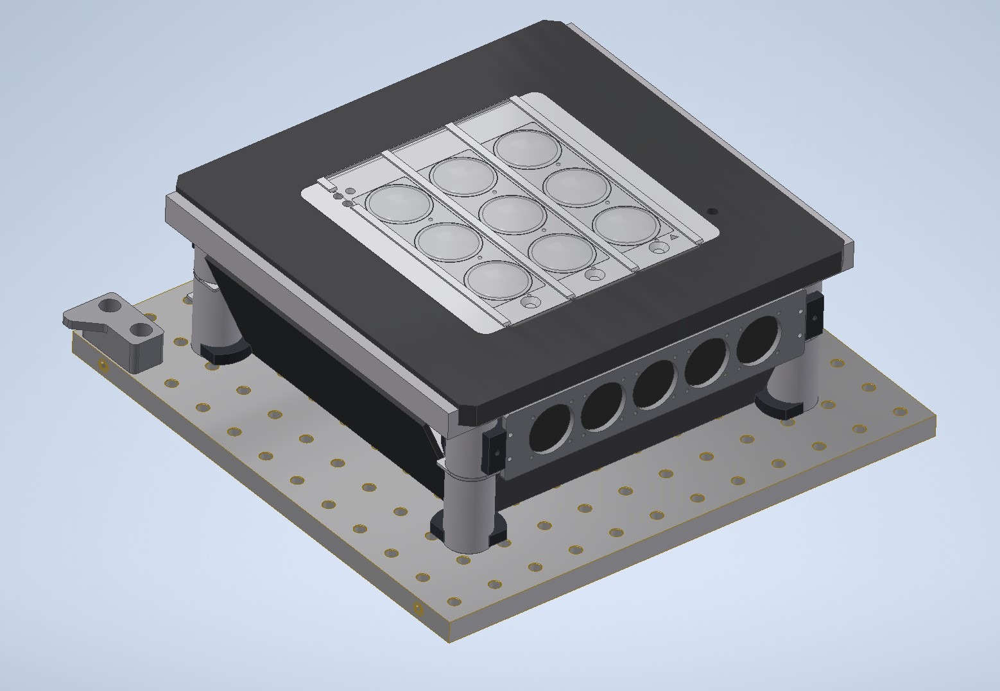
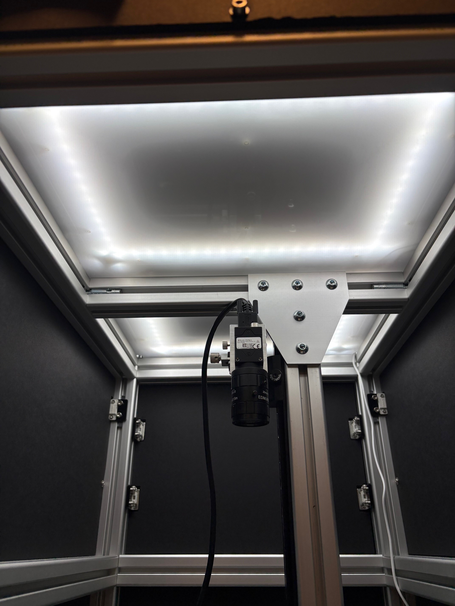
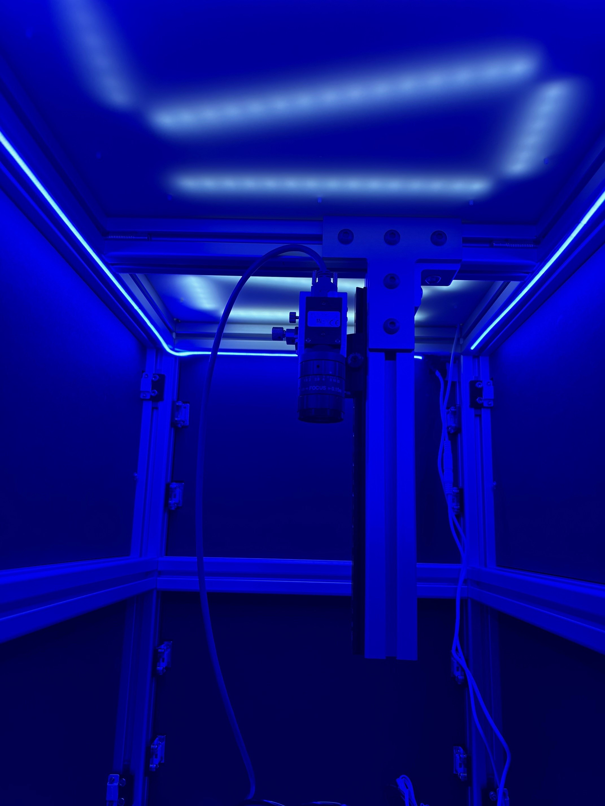

######  Contributions
CM: Design, Calibration, Systems Integration, Testing & Validation, Project Management; ES: Hardware Design and Manufacturing; JL: Software Development; CS: Conceptual Design, Testing & Validation; EK: Testing & Validation; AO: Conceptual Design, Testing & Validation, Project Management

# Introduction

This document describes fly behavioral rigs initially utilized for a behavioral screen of cell type-specific pC1 split-gal4 driver lines [@rubin_networks_2025]. These rigs, referred to as "Universal Behavior Rigs" due to their modularity and versitality, are adapted from the Fly Disco behavior rigs used in the [Branson Lab](https://www.janelia.org/lab/branson-lab) [@robie_fly_2024]. The Github repository for the original Fly Disco instrumentation can be found [here](https://github.com/arobie/FlyDiscoHardware). These rigs exhibit [uniform LED boards for back lighting and optogenetics](https://github.com/janelia-experimental-technology/RGB-IR-LED-Boards) and mounted cameras in a light-tight enclosure. To make our rigs more flexible for a variety of experiments, we install a modified baseplate over the backlight board, which accepts diverse 3D-printed arenas.

# Hardware

## Modular Behavior Rig with Bubble Array
The Inventor CAD files for the Universal Behavior Rig can be found in [this github repository](https://github.com/otopalik-lab/Universal-Fly-Rig-CAD). The main assembly is `RUBIN UNIVERSAL RIG ASSY.iam` which has also been exported as an `.stp` file for viewing outside of Inventor. 

::: {#fig-Universal-Rig layout-ncol=2}

{#fig-universal-rig width=88%}

{#fig-universal-image}

Universal Rig
:::

A [custom LED board](https://github.com/janelia-experimental-technology/RGB-IR-LED-Boards) with IR and three additional wavelength light channels is mounted to a breadboard in the main compartment of the light-tight frame. The breadboard is cooled via circulating coolant ([Koolance 702](https://koolance.com/liq-702-liquid-coolant-bottle-high-performance-700ml-blue?gad_campaignid=21575818211&gad_source=1&gclid=CjwKCAjwq9rFBhAIEiwAGVAZP-IAWXwja9OxuFcEwmsnKg5kCWydgSfXmorimJVSYiJQW6Ww0YI0exoC9B4QAvD_BwE)) pumped from a chiller housed on the lower shelf of the frame, providing heat dissipation from the experimental area. An array of fans is mounted just below the fly arenas to circulate air and further dissipate heat. The LED board has many individual LEDs uniformly spread over the board. To further increase the uniformity of the light source, angled mirrors are mounted outside of the LED board and a diffusive panel is mounted between the LED board and the fly arena.

There were two Universal Fly Rigs used for the pC1 behavioral screen. These systems exhibit different LED channel complements on their LED boards. Both rigs have 860nm LEDS for camera back lighting. For color channels, one rig has an RGB board (660nm, 525nm, 465nm) and the other rig has an RGG board (660nm, double 525nm channels).

{#fig-LED-board width=60%}

A black anodized machined plate fits over the LED board assembly to support swappable fly arenas. An IR indicator is mounted to the underside of the plate with 3 LEDs that turn on when each color channel on the LED board turns on, respectively. The arenas used on the Universal Fly Rig for this P1 screen are a 3x3 fly bubble array. Additional details for the bubble array arenas are located in the [Fly Bubble Array Fabrication](#Fly-Bubble-Array-Fabrication) section.

{#fig-bubble-CAD width=60%}

There is a FLIR Blackfly USB camera (BFS-U3-17S7M-C) mounted over the arena with a 25mm lens (Edmund Optics #86572) and IR filter (Edmund Optics #89836). Custom brackets mount the camera to a post with a 2 DOF stage (X/Y translation) and linear rail (Z translation) between for fine positioning.  

Above the camera, there are dimmable LED strip lights separated from the main chamber by a diffusive panel to provide ambient lighting during experiments. The rig with the RGG LED board has blue strip lights and the rig with the RGB LED board has white strip lights. 

::: {#fig-ambient-lighting layout-ncol=2}

{#fig-white-LEDs}

{#fig-blue-LEDs}

Ambient Lighting
:::

### Fly Bubble Array Fabrication

The 3x3 fly bubble array is a combination of 3D printed and thermoformed parts. The base plate, `UNIVERSAL BUBBLE ARRAY PLATE.ipt`, was printed in ABS on a Stratasys F170. The arena floors,`UNIVERSAL BUBBLE ARRAY DIFFUSOR PRINT.ipt` are multimaterial prints made on a Stratasys J850. The floors have a thin layer of Stratasys VeroWhite over a layer of Stratasys VeroClear. This combination optimizes the transparency and structural integrity of the floor, so that sufficient light can pass through the floor for optogenetic experiments. Circle outlines are printed on the white layer in Stratasys VeroBlack to assist in the alignment of the bubbles and to more easily identify arena area in recorded videos. The arena floors are glued into the base plate.

The bubbles are fabricated by thermoforming a clear plastic sheet over a mold, the details of which can be found [in this document](assets/Fly Bubble Instructions.pdf). The Bubble-Thermoforming folder in the [Universal Fly Rig CAD repository](https://github.com/otopalik-lab/Universal-Fly-Rig-CAD) contains the relevant files for fabrication.

# Software

There are github repositories for the [RGB Universal Rig](https://github.com/otopalik-lab/UniversalRig_RGB) and [RGG Universal Rig](https://github.com/otopalik-lab/UniversalRig_RGG) software. Both repositories have a readme with detailed installation and setup instructions (these are approximately the same for both systems).

# Rig Operation for Experiments

A quick guide on running the universal behavior rigs can be found [here](assets/QuickGuideOnRunningRigs_AOrigs.pdf), and here you can find a sample [LED Protocol](assets/quicktestLEDprotocol.xlsx) that works for both RGG and RGB lightboards. We find that standardized metadata formats are useful when conducting behavioral screens and/or experiments at scale: [Experimental Protocol](assets/Sample_ExperimentalProtocol.xlsx), [Rearing Protocol](assets/Sample_RearingProtocol.xlsx), and [Handling Protocol](assets/Sample_HandlingProtocol.xlsx).

# Related Github Repositories

1. [LED backlights](https://github.com/janelia-experimental-technology/RGB-IR-LED-Boards)
2. [Design (CAD) Files for Rig Components](https://github.com/otopalik-lab/Universal-Fly-Rig-CAD)
3. [BIAS Video Acquisition Software](https://github.com/kristinbranson/BIASJAABA)
4. [Operating Software for Universal Behavior Rigs with RGB LED Boards](https://github.com/otopalik-lab/UniversalRig_RGB)
5. [Operating Software for Universal Behavior Rigs with RGG LED Boards](https://github.com/otopalik-lab/UniversalRig_RGG)
6. Video Processing & Animal Tracking Pipeline: [FlyDiscoAnalysis](https://github.com/kristinbranson/FlyDiscoAnalysis), [FlyTracker](https://github.com/kristinbranson/FlyTracker), [JAABA: Janelia Automatic Animal Behavior Annotator](https://github.com/kristinbranson/JAABA)
7. [Repository for Data Analysis in pC1 Driver Line Behavioral Screen](https://github.com/otopalik-lab/pC1BehavioralAnalysis)

# Acknowledgments

Many of the components described in this document were designed and fabricated by members of [jET](https://www.janelia.org/support-team/janelia-experimental-technology). In addition to the authors of this document, Sam Jager and Alex Sohn fabricated and assembled several components on these rigs. Alice Robie and Kristin Branson, of the [Branson Lab](https://www.janelia.org/lab/branson-lab), were consulted throughout the development process to ensure system stability and compatability with the Fly Disco Analysis pipeline [@robie_fly_2024]. 

# References
